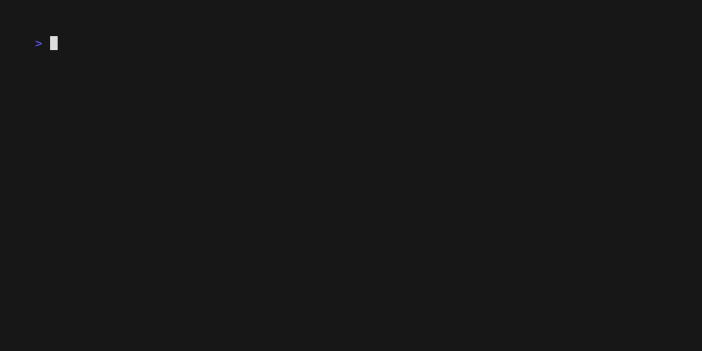

[](https://github.com/mactat/framed/actions/workflows/release.yaml) [](https://github.com/mactat/framed/actions/workflows/pr.yaml)       

# Framed - Files and Directories Reusability, Architecture, and Management

Framed is a CLI tool that simplifies the organization and management of files and directories in a reusable and architectural manner. It provides YAML templates for defining project structures and enables workflows based on those.

To always be in sync with the YAML template, Framed provides a built-in test command that can be used in CI/CD pipelines to verify the project structure.

## Demo



## Features

- **YAML Templates**: Framed uses YAML templates to define the entire project structure.

- **Always in Sync**: Framed provides a built-in test command that can be used in CI/CD pipelines to verify the project structure and ensure that it is always in sync with the YAML template.

- **Consistency Across Projects**: Framed offers a consistent way of organizing files and directories across different projects.

## Example configuration

To get started with Framed, you can use the following example:

```yaml
# Framed Configuration
name: framed

structure:
  name: root
  maxDepth: 5 # Disallow dirs deeper than 5
  files:
    - README.md
    - framed.yaml
    - main.go
    - go.mod
    - go.sum
    - .gitignore
  dirs:
    - name: cmd
      allowedPatterns:
        - ".go"
      forbiddenPatterns:
        - "_test.go" # Disallow tests in /src
    - name: pipelines
      maxCount: 2
      allowedPatterns:
        - ".yml"
        - ".yaml" # only yaml files allowed
      files:
        - pr.yaml
    - name: dockerfiles
      minCount: 1 # At least one file has to be there
      allowChildren: false # Allow subdirectories creation, default true
      allowedPatterns:
        - ".dockerfile"
    - name: docs
      maxCount: 10 # No more than 10 files per dir
      allowedPatterns:
        - ".md"
        - ".txt"
      dirs:
        - name: design
    - name: examples
```

### Project Structure Definition

Framed allows you to define the desired structure of your project using a YAML-based configuration file. The configuration specifies the required files and directories that should exist in the project.

### Root-level Requirements

The structure section defines the files that are required at the root level of the project. These files must be present for the project to be considered valid.

### Nested Structure

The dirs section allows you to define nested directories within the project structure. Each subdirectory can have its own set of required files and directories.

### File Requirements

You can specify file requirements using the files property. It ensures that specific files are present within the designated directory.

### File Patterns

The allowedPatterns property enables you to define file patterns using glob syntax. This allows for more flexible matching of files based on their extensions or naming conventions.

### Forbidden Files

The forbiddenPatterns property lets you specify file patterns that are not allowed within a directory. This can be useful for enforcing certain naming conventions or excluding specific types of files.

### Minimum File Count

The minCount property allows you to set a minimum count for files within a directory. It ensures that a certain number of files must be present in the directory.

### Maximum File Count

The maxCount property allows you to set a maximum count for files within a directory. It limits the number of files that can exist within the directory.

### Allowing Children

The allowChildren property, when set to true, permits the presence of additional directories within a specified directory. This provides flexibility for organizing files and directories within the project.

## Installation

### Brew Installation

1. Open a terminal and run the following command:

   ```shell
   brew tap mactat/mactat
   brew install framed
   ```

### Darwin (macOS) Installation

1. Download the `framed-darwin-amd64-<version>.tar.gz` package from release page.

2. Extract the package by double-clicking on the downloaded file or using a tool like `tar` in your terminal:

   ```shell
   tar -xzf framed-darwin-amd64-<version>.tar.gz
   ```

3. This will extract the `framed` binary.

4. Open a terminal and navigate to the extracted directory:

   ```shell
   cd framed-darwin-amd64-<version>
   ```

5. Make the binary executable by running the following command:

   ```shell
   chmod +x framed
   ```

6. Move the `framed` binary to a directory in your system's `PATH` so that it can be accessed from anywhere. For example:

   ```shell
   sudo mv framed /usr/local/bin/
   ```

7. You can now use the `framed` command to execute the application.

### Linux Installation

1. Download the `framed-linux-amd64-<version>.tar.gz` package from release page.

2. Extract the package using the following command in your terminal:

   ```shell
   tar -xzf framed-linux-amd64-<version>.tar.gz
   ```

3. This will extract the `framed` binary.

4. Open a terminal and navigate to the extracted directory:

   ```shell
   cd framed-linux-amd64-<version>
   ```

5. Make the binary executable by running the following command:

   ```shell
   chmod +x framed
   ```

6. Move the `framed` binary to a directory in your system's `PATH` so that it can be accessed from anywhere. For example:

   ```shell
   sudo mv framed /usr/local/bin/
   ```

7. You can now use the `framed` command to execute the application.

### Windows Installation

1. Download the `framed-windows-amd64-<version>.tar.gz` package from release page.

2. Extract the package using a file extraction tool like 7-Zip or WinRAR.

3. This will extract the `framed.exe` binary.

4. Move the `framed.exe` binary to a directory that is included in your system's `PATH`, such as `C:\Windows` or `C:\Windows\System32`.

5. You can now use the `framed` command to execute the application from the Command Prompt or PowerShell.

**Please note that the exact steps may vary depending on your system configuration.**

## Usage

**Note**: The following commands assume that you have already installed Framed and added it to your system's PATH environment variable.

**Note**: By default template file is `framed.yaml`. You can specify a different template file using the `--template` flag f.e `--template path/to/my-template.yaml`.

### 1. Creating a Project Structure

To create a new project structure using a YAML template, run the following command:

```bash
framed create
```

If you also want to create required files, run the following command:

```bash
framed create --files
```

### 2. Capturing current project structure

To capture the current project structure as a YAML template, run the following command:

```bash
framed capture --output <template-file>
```

### 3. Test Project Structure (CI/CD)

To test the project structure for consistency and compliance with the YAML template, run the following command:

```bash
framed verify
```

For a complete list of available commands and usage examples, refer to the [documentation](link-to-full-docs).

### 4. Visualize Project Structure

To visualize the project structure, run the following command:

```bash
framed visualize
```

### 5. Importing Project Structure

To import the project structure from url, run the following command:

```bash
framed import --url <url>
```

url has to be pointing to a yaml file with valid structure.

To import an example project structure, run the following command:

```bash
framed import --example <example-name>
```

Currently available examples:

- python
- golang

See [examples](./examples) for more details.

## Running from docker

To run framed from docker, run the following command:

```bash
docker run --rm -v $(pwd):/app --user $(id -u):$(id -g) mactat/framed framed <command>
```

example:

```bash
docker run --rm -v $(pwd):/app --user $(id -u):$(id -g) mactat/framed framed import --example python
```

Images can be found on [dockerhub](https://hub.docker.com/r/mactat/framed).


## Github Action

You can use framed as a github action to verify your project structure. Minimal example:

  ```yaml
  name: Verify Project Structure
  on: [push, pull_request]
  jobs:
    verify:
      runs-on: ubuntu-latest
      steps:
        - uses: actions/checkout@v2
        - name: Verify Project Structure
          uses: mactat/framed@0.0.7
          with:
            template: './framed.yaml' # Optional, default is framed.yaml
            version: 'v0.0.8'         # Optional, default is v0.0.8
  ```

## TODO

- [ ] Add support from importing part of the structure from url or file like:

  ```yaml
  name: framed

  structure:
    name: root
    dirs:
      - name: other
        template: other.yaml # Use another template for this dir
      - name: another
        template: https://yourfile.com/framed.yaml # Share templates between projects
  ```

- [x] Add some tests
- [ ] Add contributing guidelines
- [ ] Add more examples
- [x] Create a github action for running tests
- [ ] Move remaining business logic to a separate package
